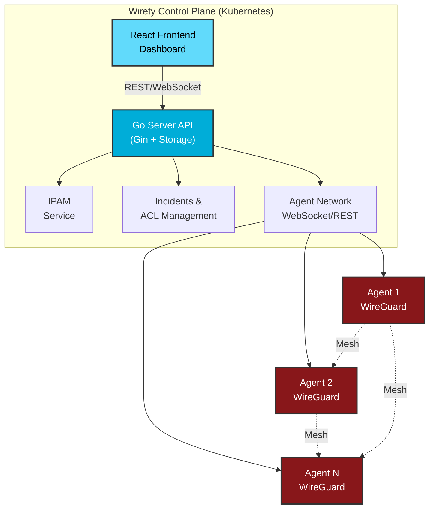

<div align="center">


# Wirety

**Modern WireGuard Mesh Network with Dynamic Security & Zero-Trust Architecture**

[](https://opensource.org/licenses/MIT)
[](https://go.dev/)
[](https://github.com/pewty-fr/wirety/releases)
[](https://rg.fr-par.scw.cloud/wirety)
[](https://rg.fr-par.scw.cloud/wirety/chart)

[🚀 Quick Start](#-quick-start) • [📚 Documentation](#-documentation) • [🎯 Features](#-features) • [🤝 Contributing](#-contributors)

---

</div>

## 🎯 What is Wirety?

Wirety is a **next-generation WireGuard orchestration platform** that brings dynamic security, automatic incident response, and zero-trust networking to your infrastructure. Built with Go and React, it provides:

- 🔄 **Dynamic Mesh Networking** - Automatic peer discovery and configuration
- 🛡️ **Intelligent Security** - Real-time threat detection and automated incident response
- 🎭 **Zero-Trust ACLs** - Fine-grained access control with automatic policy enforcement
- 📊 **Beautiful Dashboard** - Modern React UI for network management
- 🔌 **Agent-Based** - Lightweight agents for automatic configuration synchronization
- 🌐 **IPAM Built-in** - Intelligent IP address management
- 🔐 **OIDC Integration** - Enterprise-ready authentication

## ✨ Features

### Core Capabilities

| Feature | Description |
|---------|-------------|
| **🔄 Dynamic Configuration** | Agents automatically sync WireGuard configs in real-time |
| **🛡️ Incident Detection** | Automatic detection of suspicious activities (session conflicts, IP jumps) |
| **⚡ Auto-Remediation** | Dynamic ACL updates to block threats instantly |
| **🎯 Network Isolation** | Create isolated network segments with custom policies |
| **📡 DNS Resolution** | Built-in DNS server for peer name resolution |
| **🔥 NAT & Firewall** | Automatic NAT configuration and firewall rules |
| **📊 Real-time Monitoring** | WebSocket-based live network status |
| **🔐 Enterprise Auth** | OIDC/OAuth2 support (Keycloak, Dex, etc.) |

### Security Features

- ✅ **Session Conflict Detection** - Identifies compromised credentials
- ✅ **Suspicious Activity Alerts** - Detects unusual peer behavior
- ✅ **Automatic ACL Updates** - Blocks malicious peers in real-time
- ✅ **Audit Trail** - Complete security incident history
- ✅ **Manual Resolution** - Review and approve security actions

## 🏗️ Architecture



## 📦 Container Registries

All Wirety components are available as container images:

| Component | Registry | Latest Tag |
|-----------|----------|------------|
| **Server** | `rg.fr-par.scw.cloud/wirety/server` | `latest` |
| **Frontend** | `rg.fr-par.scw.cloud/wirety/front` | `latest` |
| **Documentation** | `rg.fr-par.scw.cloud/wirety/doc` | `latest` |
| **Helm Chart** | `oci://rg.fr-par.scw.cloud/wirety/chart` | See [releases](https://github.com/pewty-fr/wirety/releases) |

### Agent Binary Releases

Download pre-compiled binaries from [GitHub Releases](https://github.com/pewty-fr/wirety/releases):

- Linux (amd64, arm64)
- macOS (amd64, arm64)
- Windows (amd64)

## 🚀 Quick Start

### Deploy with Helm (Recommended)

Deploy the complete Wirety platform (server + frontend) to Kubernetes:

```bash
# Add the Helm repository
helm install wirety oci://rg.fr-par.scw.cloud/wirety/chart/wirety \
  --version <version> \
  --namespace wirety \
  --create-namespace \
  --set ingress.enabled=true \
  --set ingress.hosts[0].host=wirety.example.com \
  --set ingress.hosts[0].paths[0].path=/ \
  --set ingress.hosts[0].paths[0].pathType=Prefix
```

### Deploy Agent on Host

1. **Download the agent:**

```bash
# Linux amd64
wget https://github.com/pewty-fr/wirety/releases/download/agent/v<version>/wirety-agent-linux-amd64
chmod +x wirety-agent-linux-amd64
sudo mv wirety-agent-linux-amd64 /usr/local/bin/wirety-agent

# Or use curl
curl -L https://github.com/pewty-fr/wirety/releases/download/agent/v<version>/wirety-agent-linux-amd64 -o wirety-agent
chmod +x wirety-agent
```

2. **Get your enrollment token from the Wirety UI**

3. **Run the agent:**

```bash
sudo wirety-agent \
  --server https://wirety.example.com \
  --token YOUR_ENROLLMENT_TOKEN \
  --nat eth0
```

4. **Run as systemd service:**

```bash
sudo tee /etc/systemd/system/wirety-agent.service <<EOF
[Unit]
Description=Wirety Agent
After=network.target

[Service]
Type=simple
ExecStart=/usr/local/bin/wirety-agent
Environment="SERVER_URL=https://wirety.example.com"
Environment="TOKEN=YOUR_ENROLLMENT_TOKEN"
Environment="NAT_INTERFACE=eth0"
Restart=always
RestartSec=10

[Install]
WantedBy=multi-user.target
EOF

sudo systemctl daemon-reload
sudo systemctl enable wirety-agent
sudo systemctl start wirety-agent
```

## ⚙️ Configuration

### Server Environment Variables

Configure the Wirety server with these environment variables:

| Variable | Description | Default | Required |
|----------|-------------|---------|----------|
| `HTTP_PORT` | HTTP server port | `8080` | No |
| `AUTH_ENABLED` | Enable OIDC authentication | `false` | No |
| `AUTH_ISSUER_URL` | OIDC provider URL | - | If auth enabled |
| `AUTH_CLIENT_ID` | OIDC client ID | - | If auth enabled |
| `AUTH_CLIENT_SECRET` | OIDC client secret | - | If auth enabled |
| `AUTH_JWKS_CACHE_TTL` | JWKS cache duration (seconds) | `3600` | No |
| `DB_ENABLED` | Enable database persistence | `false` | No |
| `DB_DSN` | PostgreSQL connection string | `postgres://...` | If DB enabled |
| `DB_MIGRATIONS_DIR` | Database migrations path | `internal/adapters/db/postgres/migrations` | No |

**Example with OIDC:**

```bash
export AUTH_ENABLED=true
export AUTH_ISSUER_URL=https://keycloak.example.com/realms/wirety
export AUTH_CLIENT_ID=wirety
export AUTH_CLIENT_SECRET=your-secret
```

### Agent Environment Variables

Configure the Wirety agent with these environment variables:

| Variable | Description | Default | Required |
|----------|-------------|---------|----------|
| `SERVER_URL` | Wirety server URL | `http://localhost:8080` | Yes |
| `TOKEN` | Peer enrollment token | - | Yes |
| `WG_CONFIG_PATH` | WireGuard config file path | Auto-generated | No |
| `WG_APPLY_METHOD` | Apply method: `wg-quick` or `syncconf` | `wg-quick` | No |
| `NAT_INTERFACE` | Network interface for NAT | `eth0` | No |

**Example:**

```bash
export SERVER_URL=https://wirety.example.com
export TOKEN=kNXyM8uhXlmBjQm1S6p-xbgFXkBkJCdT3sboOZ8wcjs
export NAT_INTERFACE=ens5
```

### Helm Chart Values

Customize your deployment with `values.yaml`:

```yaml
# Server configuration
server:
  image:
    repository: rg.fr-par.scw.cloud/wirety/server
    tag: "latest"
  
  env:
    HTTP_PORT: "8080"
    AUTH_ENABLED: "true"
    AUTH_ISSUER_URL: "https://auth.example.com"
    AUTH_CLIENT_ID: "wirety"
    AUTH_CLIENT_SECRET: "secret"

# Frontend configuration
frontend:
  image:
    repository: rg.fr-par.scw.cloud/wirety/front
    tag: "latest"
  
  env:
    REACT_APP_API_URL: "/api"

# Ingress configuration
ingress:
  enabled: true
  className: "nginx"
  annotations:
    cert-manager.io/cluster-issuer: letsencrypt-prod
  hosts:
    - host: wirety.example.com
      paths:
        - path: /
          pathType: Prefix
```

## 📚 Documentation

Full documentation is available at [https://doc.wirety.fr](https://doc.wirety.fr)

- 📖 **[Getting Started](https://doc.wirety.fr/docs/intro)** - Quick start guide
- 🚀 **[Deployment Guide](https://doc.wirety.fr/docs/deployment)** - Production deployment options
- 🏗️ **[Server Configuration](https://doc.wirety.fr/docs/server)** - Server setup and environment
- 🤖 **[Agent Setup](https://doc.wirety.fr/docs/agent)** - Agent installation and configuration
- 🌐 **[Network Management](https://doc.wirety.fr/docs/network)** - Network configuration
- 👥 **[Peer Management](https://doc.wirety.fr/docs/peers)** - Managing peers and access
- 📡 **[IPAM](https://doc.wirety.fr/docs/ipam)** - IP address management
- 🔐 **[Incidents & Security](https://doc.wirety.fr/docs/incidents)** - Security incident response
- 🔑 **[OIDC Authentication](https://doc.wirety.fr/docs/guides/oidc)** - Configure authentication
- 🔧 **[Troubleshooting](https://doc.wirety.fr/docs/troubleshooting)** - Common issues and solutions

## 🛠️ Development

### Prerequisites

- Go 1.25+ (server & agent)
- Node.js 18+ (frontend)
- Docker & Docker Compose
- Kubernetes cluster (for Helm testing)

### Local Development

```bash
# Clone the repository
git clone https://github.com/pewty-fr/wirety.git
cd wirety

# Start the server
cd server
go run cmd/main.go

# Start the frontend (in another terminal)
cd front
npm install
npm run dev

# Build the agent
cd agent
go build -o wirety-agent ./cmd/agent
```

## 🤝 Contributors

<div align="center">

**Made with ❤️ by the Wirety community**

<a href="https://github.com/pewty-fr/wirety/graphs/contributors">
  
</a>

### Special Thanks

This project is proudly developed by [**Pewty**](https://pewty.fr) 🎉

*Want to contribute? Check out our [Contributing Guide](CONTRIBUTING.md)!*

</div>

## 📄 License

Wirety is **free and open source** software licensed under the [MIT License](LICENSE).

```
Copyright (c) 2024 Pewty

Permission is hereby granted, free of charge, to any person obtaining a copy
of this software and associated documentation files (the "Software"), to deal
in the Software without restriction, including without limitation the rights
to use, copy, modify, merge, publish, distribute, sublicense, and/or sell
copies of the Software, and to permit persons to whom the Software is
furnished to do so, subject to the following conditions:
```

## 🔗 Links

- 🌐 **Website**: [https://pewty.fr](https://pewty.fr)
- 📖 **Documentation**: [https://doc.wirety.fr](https://doc.wirety.fr)
- 📦 **GitHub**: [https://github.com/pewty-fr/wirety](https://github.com/pewty-fr/wirety)
- 🐳 **Container Registry**: [rg.fr-par.scw.cloud/wirety](https://console.scaleway.com/registry/)
- 💬 **Issues**: [GitHub Issues](https://github.com/pewty-fr/wirety/issues)
- 🤝 **Contributing**: [Contributing Guide](CONTRIBUTING.md)

---

<div align="center">

**Star ⭐ the project if you like it!**

Made with 💚 by the open-source community

</div>
