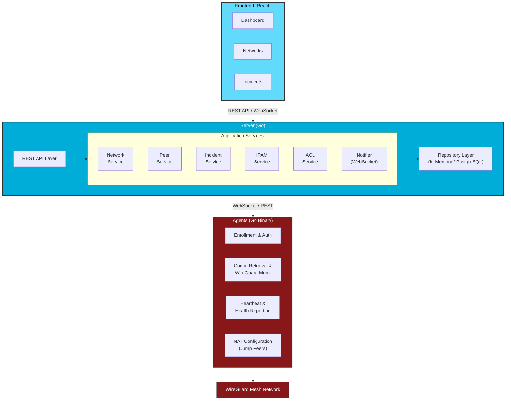

This document describes the Wirety system architecture, components, and design decisions.

## System Overview

Wirety is a distributed system that orchestrates WireGuard mesh networks with dynamic security capabilities. It consists of several key components that work together to provide automated peer management, incident response, and centralized monitoring.



## Components

### Frontend

**Technology:** React 19, TypeScript, Vite  
**Purpose:** Web-based UI for managing networks, peers, and incidents

**Features:**
- Dashboard with network overview and statistics
- Network creation and CIDR management
- Peer management (jump, dynamic, static)
- Incident monitoring and resolution
- User management (when OIDC enabled)
- Real-time topology visualization
- IPAM capacity monitoring

**Communication:**
- REST API for CRUD operations
- WebSocket for real-time updates

### Server

**Technology:** Go 1.21+, Gin framework  
**Purpose:** Central orchestration and API server

**Responsibilities:**
- RESTful API for frontend and agents
- Peer lifecycle management
- Network and IPAM orchestration
- ACL-based security enforcement
- Incident detection and management
- WebSocket notifications
- OIDC authentication (optional)
- WireGuard config generation

**Key Services:**

#### Network Service
- Create/update/delete networks
- CIDR validation and constraints
- Jump peer assignment
- Capacity monitoring

#### Peer Service
- Peer creation (jump, dynamic, static)
- Token generation for enrollment
- Config generation per peer type
- Heartbeat processing
- Endpoint observation

#### Incident Service
- Session conflict detection
- Shared config detection  
- Suspicious activity detection
- ACL blocking automation
- Resolution and audit logging

#### IPAM Service
- IP allocation from network CIDR
- Address conflict prevention
- Deallocation on peer deletion
- Capacity calculation

#### ACL Service
- Blocked peer tracking
- Config generation filtering
- Incident integration

#### Notifier Service
- WebSocket broadcast
- Network update events
- Agent config refresh triggers

### Agent

**Technology:** Go 1.21+ (cross-platform binary)  
**Purpose:** Automated peer configuration and health reporting

**Responsibilities:**
- Token-based enrollment
- WireGuard config retrieval
- Interface management (wg-quick/syncconf)
- NAT configuration (jump peers)
- Heartbeat reporting
- Real-time config updates via WebSocket

**Deployment:**
- Linux (systemd service)
- macOS (launchd)
- Windows (service)
- Docker container

**Security:**
- Token used only during enrollment
- Ephemeral session authentication
- Config retrieved over HTTPS
- Private keys never transmitted

### Storage

**Current:** In-memory (default)  
**Future:** PostgreSQL support

**Data Model:**
- Networks (CIDR, domain, peers)
- Peers (type, keys, endpoint, metadata)
- ACL (blocked peer IDs)
- Incidents (type, state, audit)
- IPAM allocations

## Architecture Patterns

### Hexagonal Architecture (Ports & Adapters)

The server follows hexagonal architecture principles:

```
Domain (Core Business Logic)
    ├── peer/
    ├── network/
    ├── incident/
    └── ipam/

Application (Use Cases)
    ├── peer service
    ├── network service
    └── incident service

Adapters (External Interfaces)
    ├── api/ (HTTP handlers)
    ├── db/ (repositories)
    ├── ws/ (WebSocket)
    └── wg/ (WireGuard config)

Ports (Interfaces)
    └── ports.go
```

**Benefits:**
- Testable core logic
- Technology-agnostic domain
- Easy adapter replacement
- Clear dependency direction

### Event-Driven Updates

Real-time updates use event-driven architecture:

1. State change occurs (peer created, incident detected)
2. Service emits notification event
3. Notifier broadcasts via WebSocket
4. Agents/Frontend receive and react
5. Agents fetch updated config

**Benefits:**
- Near-instant config propagation
- Reduced polling overhead
- Scalable notification delivery

### Token-Based Enrollment

Agent enrollment follows secure token pattern:

1. Server generates unique enrollment token
2. Token displayed in UI (one-time view)
3. Agent uses token for enrollment
4. Server validates token and creates session
5. Session used for subsequent requests
6. Token invalidated on peer deletion

**Security properties:**
- Token serves as authorization
- Short-lived credential usage
- No password storage
- Revocable access

## Data Flow

### Peer Enrollment (Dynamic)

```
Frontend → Server: Create peer (use_agent=true)
    Server generates token + stores peer
Frontend ← Server: Return token

Agent → Server: Enroll with token
    Server validates token
    Server generates WireGuard keys
    Server stores session
Agent ← Server: Return config + session ID

Agent → Server: Heartbeat (periodic)
    Server updates last_seen, endpoint
Agent ← Server: ACK

Server: Network update event
    Server → Notifier: Broadcast event
    Notifier → Agent: WebSocket push

Agent → Server: Fetch updated config
Agent: Apply config to WireGuard
```

### Incident Detection & Response

```
Agent → Server: Heartbeat #1 from IP-A
    Server records session

Agent → Server: Heartbeat #2 from IP-B (within 5 min)
    Server detects session conflict
    Server creates incident
    Server adds peer to ACL blocked list
    Server → Notifier: Broadcast ACL update

Notifier → Agents: Network update event
Agents → Server: Fetch config
    Server excludes blocked peer from configs

Frontend: Admin reviews incident
Frontend → Server: Resolve incident
    Server removes peer from ACL
    Server logs resolution audit
    Server → Notifier: Broadcast update

Agents: Receive config with peer restored
```

### Config Generation

Server generates peer-specific configs:

1. **Fetch network and all peers**
2. **Filter by ACL**: Exclude blocked peers
3. **Apply peer constraints**:
   - Isolated peers: Only jump peers in allowed IPs
   - Full encapsulation: Add 0.0.0.0/0
   - Additional allowed IPs: Include custom CIDRs
4. **Generate WireGuard syntax**
5. **Return config to agent**

## Security Considerations

### Authentication & Authorization

**Frontend:**
- Optional OIDC integration
- JWT tokens for API access
- Role-based access control (future)

**Agent:**
- Token-based enrollment
- Session-based subsequent access
- No stored credentials

### Secrets Management

**Private Keys:**
- Generated server-side
- Never included in API responses
- Tagged `json:"-"` in structs
- Stored securely in repository

**Enrollment Tokens:**
- Unique per peer
- Invalidated on peer deletion
- Should be treated as secrets
- Time-limited validity (future enhancement)

### Network Security

**Communication:**
- HTTPS required for production
- WebSocket over TLS (WSS)
- WireGuard provides transport encryption

**Firewall:**
- Server API should be behind ingress
- WireGuard ports need UDP access
- Agent needs outbound HTTPS

### Incident Response

**Automated Blocking:**
- ACL-based containment
- Non-destructive (peer not deleted)
- Auditable resolution

**Detection Mechanisms:**
- Session conflicts (multiple simultaneous agents)
- Shared configs (rapid endpoint changes)
- Suspicious activity (excessive changes)

## Scalability

### Current Limitations

**In-Memory Storage:**
- Single server instance
- Data lost on restart
- Limited to server memory

**Future Enhancements:**

**Database Backend:**
- PostgreSQL support
- Multi-instance deployment
- Persistent storage

**Agent Connection Pooling:**
- WebSocket connection scaling
- Load balancer sticky sessions
- Horizontal scaling

**Caching:**
- Config generation caching
- JWKS caching (already implemented)
- Network topology caching

## Technology Stack

| Component | Technology | Version |
|-----------|-----------|---------|
| Server | Go | 1.21+ |
| Server Framework | Gin | Latest |
| Agent | Go | 1.21+ |
| Frontend | React | 19.x |
| Frontend Build | Vite | Latest |
| Frontend Language | TypeScript | 5.x |
| Documentation | Docusaurus | 3.x |
| Deployment | Kubernetes + Helm | 1.24+ |
| Container Registry | Scaleway | - |

## Development Principles

### Clean Architecture
- Separation of concerns
- Dependency inversion
- Testable components

### API-First Design
- OpenAPI/Swagger documentation
- Versioned endpoints (/api/v1)
- RESTful conventions

### Security by Default
- HTTPS enforcement
- ACL-based isolation
- Automated incident response
- Minimal credential storage

### Cloud-Native
- Stateless services (future with DB)
- Containerized deployment
- Kubernetes-ready
- Horizontal scaling support

## Future Roadmap

### Storage & Persistence
- PostgreSQL backend
- Database migrations
- Multi-instance support

### Security Enhancements
- Role-based access control (RBAC)
- Token expiration
- Automatic key rotation
- Audit logging

### Monitoring & Observability
- Prometheus metrics
- OpenTelemetry tracing
- Grafana dashboards
- Health checks

### Features
- Peer groups
- Network templates
- Bulk operations
- Config versioning
- Backup/restore

## Related Documentation

- [Deployment Guide](./deployment)
- [Server Configuration](./server)
- [Agent Setup](./agent)
- [Network Management](./network)
- [Security & Incidents](./incidents)
