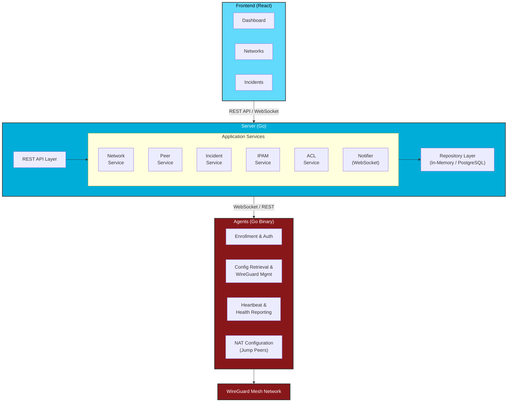

Ce document décrit l'architecture du système Wirety, ses composants et les décisions de conception.

## Vue d'ensemble du système

Wirety est un système distribué qui orchestre des réseaux maillés WireGuard avec des capacités de sécurité dynamiques. Il est composé de plusieurs composants clés qui travaillent ensemble pour fournir une gestion automatisée des peers, une réponse aux incidents et une surveillance centralisée.



## Composants

### Frontend

**Technologie :** React 19, TypeScript, Vite  
**Objectif :** Interface web pour gérer les réseaux, les peers et les incidents

**Fonctionnalités :**
- Tableau de bord avec vue d'ensemble du réseau et statistiques
- Création de réseaux et gestion des CIDR
- Gestion des peers (jump, dynamique, statique)
- Surveillance et résolution des incidents
- Gestion des utilisateurs (si OIDC activé)
- Visualisation de topologie en temps réel
- Surveillance de la capacité IPAM

**Communication :**
- API REST pour les opérations CRUD
- WebSocket pour les mises à jour en temps réel

### Server

**Technologie :** Go 1.21+, framework Gin  
**Objectif :** Orchestration centrale et serveur API

**Responsabilités :**
- API RESTful pour le frontend et les agents
- Gestion du cycle de vie des peers
- Orchestration des réseaux et de l'IPAM
- Application de la sécurité basée sur les ACL
- Détection et gestion des incidents
- Notifications WebSocket
- Authentification OIDC (optionnelle)
- Génération de configuration WireGuard

**Services clés :**

#### Service Réseau
- Créer / mettre à jour / supprimer des réseaux
- Validation et contraintes CIDR
- Assignation des jump peers
- Surveillance de la capacité

#### Service Peer
- Création de peers (jump, dynamique, statique)
- Génération de tokens pour l'inscription
- Génération de configuration par type de peer
- Traitement des heartbeats
- Observation des endpoints

#### Service Incidents
- Détection de conflits de session
- Détection de configurations partagées
- Détection d'activités suspectes
- Automatisation du blocage ACL
- Résolution et journalisation d'audit

#### Service IPAM
- Allocation d'adresses IP depuis le CIDR du réseau
- Prévention des conflits d'adresses
- Désallocation lors de la suppression d'un peer
- Calcul de capacité

#### Service ACL
- Suivi des peers bloqués
- Filtrage de la génération de configuration
- Intégration avec les incidents

#### Service Notifier
- Diffusion WebSocket
- Événements de mise à jour réseau
- Déclencheurs de rafraîchissement de configuration pour les agents

### Agent

**Technologie :** Go 1.21+ (binaire multiplateforme)  
**Objectif :** Configuration automatisée des peers et reporting d'état

**Responsabilités :**
- Inscription basée sur token
- Récupération de configuration WireGuard
- Gestion des interfaces (wg-quick/syncconf)
- Configuration NAT (jump peers)
- Rapport de heartbeat
- Mises à jour de configuration en temps réel via WebSocket

**Déploiement :**
- Linux (service systemd)
- macOS (launchd)
- Windows (service)
- Conteneur Docker

**Sécurité :**
- Token utilisé uniquement lors de l'inscription
- Authentification de session éphémère
- Configuration récupérée via HTTPS
- Clés privées jamais transmises

### Stockage

**Actuel :** En mémoire (défaut)  
**Future :** Support PostgreSQL

**Modèle de données :**
- Réseaux (CIDR, domaine, peers)
- Peers (type, clés, endpoint, métadonnées)
- ACL (IDs de peers bloqués)
- Incidents (type, état, audit)
- Allocations IPAM

## Patterns d'architecture

### Architecture hexagonale (Ports & Adaptateurs)

Le serveur suit les principes de l'architecture hexagonale :

```
Domain (Core Business Logic)
    ├── peer/
    ├── network/
    ├── incident/
    └── ipam/

Application (Use Cases)
    ├── peer service
    ├── network service
    └── incident service

Adapters (External Interfaces)
    ├── api/ (HTTP handlers)
    ├── db/ (repositories)
    ├── ws/ (WebSocket)
    └── wg/ (WireGuard config)

Ports (Interfaces)
    └── ports.go
```

**Avantages :**
- Logique métier testable
- Domaine indépendant des technologies
- Remplacement facile des adaptateurs
- Direction de dépendance claire

### Mises à jour pilotées par événements

Les mises à jour en temps réel utilisent une architecture pilotée par événements :

1. Un changement d'état se produit (peer créé, incident détecté)
2. Le service émet un événement de notification
3. Le Notifier diffuse via WebSocket
4. Les agents et le frontend reçoivent et réagissent
5. Les agents récupèrent la configuration mise à jour

**Avantages :**
- Propagation de configuration quasi-instantanée
- Réduction de la charge de polling
- Distribution de notifications scalable

### Inscription basée sur token

L'inscription de l'agent suit un pattern de token sécurisé :

1. Le serveur génère un token d'inscription unique
2. Le token est affiché dans l'interface (vue unique)
3. L'agent utilise le token pour l'inscription
4. Le serveur valide le token et crée une session
5. La session est utilisée pour les requêtes suivantes
6. Le token est invalidé lors de la suppression du peer

**Propriétés de sécurité :**
- Le token sert d'autorisation
- Utilisation de crédential de courte durée
- Pas de stockage de mot de passe
- Accès révocable

## Flux de données

### Inscription d'un peer (Dynamique)

```
Frontend → Server: Créer peer (use_agent=true)
    Server génère token + stocke peer
Frontend ← Server: Retourner token

Agent → Server: S'inscrire avec token
    Server valide token
    Server génère clés WireGuard
    Server stocke session
Agent ← Server: Retourner config + ID de session

Agent → Server: Heartbeat (périodique)
    Server met à jour last_seen, endpoint
Agent ← Server: ACK

Server: Événement de mise à jour réseau
    Server → Notifier: Diffuser événement
    Notifier → Agent: Push WebSocket

Agent → Server: Récupérer config mise à jour
Agent: Appliquer config à WireGuard
```

### Détection et réponse aux incidents

```
Agent → Server: Heartbeat #1 depuis IP-A
    Server enregistre session

Agent → Server: Heartbeat #2 depuis IP-B (dans les 5 min)
    Server détecte conflit de session
    Server crée incident
    Server ajoute peer à la liste ACL bloquée
    Server → Notifier: Diffuser mise à jour ACL

Notifier → Agents: Événement de mise à jour réseau
Agents → Server: Récupérer config
    Server exclut peer bloqué des configs

Frontend: Admin examine incident
Frontend → Server: Résoudre incident
    Server retire peer de l'ACL
    Server journalise audit de résolution
    Server → Notifier: Diffuser mise à jour

Agents: Reçoivent config avec peer restauré
```

### Génération de configuration

Le serveur génère des configurations spécifiques à chaque peer :

1. **Récupérer le réseau et tous les peers**
2. **Filtrer par ACL** : Exclure les peers bloqués
3. **Appliquer les contraintes des peers** :
   - Peers isolés : Uniquement les jump peers dans les IP autorisées
   - Encapsulation complète : Ajouter 0.0.0.0/0
   - IP supplémentaires autorisées : Inclure les CIDR personnalisés
4. **Générer la syntaxe WireGuard**
5. **Retourner la configuration à l'agent**

## Considérations de sécurité

### Authentification et autorisation

**Frontend :**
- Intégration OIDC optionnelle
- Tokens JWT pour l'accès à l'API
- Contrôle d'accès basé sur les rôles (futur)

**Agent :**
- Inscription basée sur token
- Accès ultérieur basé sur session
- Pas de crédentials stockés

### Gestion des secrets

**Clés privées :**
- Générées côté serveur
- Jamais incluses dans les réponses API
- Taguées `json:"-"` dans les structs
- Stockées de façon sécurisée dans le dépôt

**Tokens d'inscription :**
- Uniques par peer
- Invalidés lors de la suppression du peer
- Doivent être traités comme des secrets
- Validité limitée dans le temps (amélioration future)

### Sécurité réseau

**Communication :**
- HTTPS requis pour la production
- WebSocket sur TLS (WSS)
- WireGuard assure le chiffrement du transport

**Pare-feu :**
- L'API du serveur doit être derrière un ingress
- Les ports WireGuard nécessitent un accès UDP
- L'agent a besoin d'HTTPS sortant

### Réponse aux incidents

**Blocage automatisé :**
- Confinement basé sur ACL
- Non destructif (le peer n'est pas supprimé)
- Résolution auditée

**Mécanismes de détection :**
- Conflits de session (plusieurs agents simultanés)
- Configurations partagées (changements d'endpoint rapides)
- Activité suspecte (changements excessifs)

## Scalabilité

### Limitations actuelles

**Stockage en mémoire :**
- Instance serveur unique
- Données perdues au redémarrage
- Limité à la mémoire du serveur

**Améliorations futures :**

**Backend de base de données :**
- Support PostgreSQL
- Déploiement multi-instance
- Stockage persistant

**Pool de connexions agent :**
- Scalabilité des connexions WebSocket
- Sessions collantes du load balancer
- Scalabilité horizontale

**Mise en cache :**
- Cache de génération de configuration
- Cache JWKS (déjà implémenté)
- Cache de topologie réseau

## Stack technologique

| Composant | Technologie | Version |
|-----------|-------------|---------|
| Server | Go | 1.21+ |
| Server Framework | Gin | Dernière |
| Agent | Go | 1.21+ |
| Frontend | React | 19.x |
| Frontend Build | Vite | Dernière |
| Frontend Language | TypeScript | 5.x |
| Documentation | Docusaurus | 3.x |
| Déploiement | Kubernetes + Helm | 1.24+ |
| Registry de conteneurs | Scaleway | - |

## Principes de développement

### Clean Architecture
- Séparation des responsabilités
- Inversion des dépendances
- Composants testables

### API-First Design
- Documentation OpenAPI/Swagger
- Endpoints versionnés (/api/v1)
- Conventions RESTful

### Sécurité par défaut
- Application HTTPS
- Isolation basée sur ACL
- Réponse automatisée aux incidents
- Stockage minimal des crédentials

### Cloud-Native
- Services stateless (futur avec DB)
- Déploiement conteneurisé
- Prêt pour Kubernetes
- Support de scalabilité horizontale

## Fonctionnalités implémentées (anciennement feuille de route)

Les éléments suivants étaient précédemment listés comme travaux futurs et sont maintenant implémentés :

- ✅ **Backend PostgreSQL** — activer avec `DB_ENABLED=true` + `DB_DSN`
- ✅ **Migrations de base de données** — appliquées automatiquement au démarrage via `cmd/kodata/migrations/`
- ✅ **Groupes de peers** — système complet Groupes/Politiques/Routes
- ✅ **Journalisation d'audit** — piste d'audit JSON structurée sur le serveur et l'agent (activer avec `AUDIT_LOG=true`)
- ✅ **Tokens API** — tokens d'accès personnels à longue durée de vie (préfixe `wirety_`, haché SHA-256)
- ✅ **Serveur MCP** — intégré à `GET/POST /mcp` avec transport HTTP Streamable

## Feuille de route future

### Améliorations de sécurité
- Rotation automatique des clés
- Application de l'expiration des tokens par politique

### Surveillance et observabilité
- Métriques Prometheus
- Tracing OpenTelemetry
- Tableaux de bord Grafana
- Vérifications d'état

### Fonctionnalités
- Templates réseau
- Opérations en masse
- Versionnage de configuration
- Sauvegarde / restauration
- Support multi-instance (nécessite un stockage partagé)

## Documentation liée

- [Guide de déploiement](/guides/deployment.md)
- [Configuration du serveur](/server.md)
- [Configuration de l'agent](/agent.md)
- [Gestion des réseaux](/network.md)
- [Sécurité et incidents](/incidents.md)
