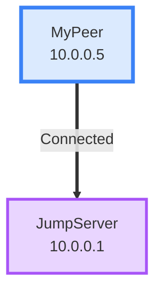

# Network Topology Implementation

## Overview
I've implemented a network topology graph visualization in the peer detail view that shows peer connectivity and access rules using Mermaid diagrams.

## Features Implemented

### 1. **Connection Status Visualization**
- **Solid lines (===)**: Active connection to jump server (peer has `session.reported_endpoint`)
- **Dashed lines (---)**: Inactive connection or regular peer-to-peer access

### 2. **Access Rules** 
The topology correctly implements these rules:
- **Jump peers**: Can access everything
- **Isolated peers**: Can only access jump servers (not other isolated or regular peers)
- **Regular peers**: Can access jump servers and other regular peers (not isolated peers)
- **Full encapsulation**: Shows connection to Internet through jump server

### 3. **Visual Indicators**
- **Blue border (thick)**: Current peer being viewed
- **Purple nodes**: Jump servers
- **Yellow nodes**: Isolated peers
- **Green nodes**: Regular peers
- **Internet node**: Shows when peer has full encapsulation enabled

### 4. **Three Rendering Engines** (You can test and choose)

#### Option 1: `mermaid-native` (Default)
- Uses Mermaid's default theme
- Clean, professional look
- Curved lines (basis curve)
- Good for general use

#### Option 2: `mermaid-svg` (Base Theme)
- Custom blue color scheme
- Linear connections
- Larger node spacing (50px)
- Better for larger networks

#### Option 3: `mermaid-canvas` (Dark Theme)
- Dark background (#1f2937)
- Blue/gray color scheme
- Renders to canvas for better performance
- Good for presentations

## How to Test

1. Open any peer detail view
2. Scroll down to see "Network Topology" section
3. Use the dropdown to switch between rendering engines
4. Observe:
   - Current peer is highlighted with thick blue border
   - Connections show as solid (active) or dashed (inactive)
   - Access rules are properly enforced
   - If peer has full_encapsulation, you'll see Internet node

## Files Created/Modified

### New Files:
- `/src/components/NetworkTopology.tsx` - Main topology component
- `/src/utils/validation.ts` - CIDR validation utilities

### Modified Files:
- `/src/components/PeerDetailModal.tsx` - Added topology section
- `/src/api/client.ts` - Added `getAllNetworkPeers()` method
- `/src/types/index.ts` - Added `PeerSession` interface

## Technical Details

### Mermaid Diagram Format


### Connection Logic
```typescript
const canAccess = (from: Peer, to: Peer): boolean => {
  if (from.is_jump) return true;  // Jump can access all
  if (to.is_jump) return true;     // All can access jump
  if (from.is_isolated && to.is_isolated) return false;
  if (from.is_isolated && !to.is_jump) return false;
  if (!from.is_jump && to.is_isolated) return false;
  return true;
};
```

## Next Steps (Choose Your Renderer)

After testing all three renderers, let me know which one you prefer:
1. **mermaid-native** - Best balance, recommended for production
2. **mermaid-svg** - Better spacing, good for complex networks
3. **mermaid-canvas** - Performance winner, great for dark mode

I can then:
- Remove the unused renderers
- Fine-tune the selected renderer's styling
- Add more features like zoom/pan controls
- Add session status indicators (last seen time, etc.)
